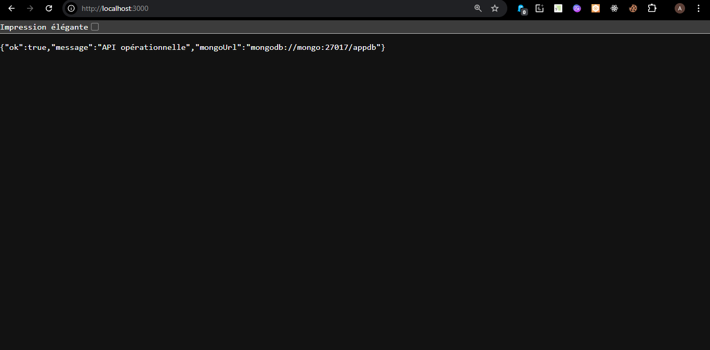

  

  

    
    
    
    
  

  

📄 Documentation – API Node.js + MongoDB avec Docker Compose
============================================================

1\. 📌 Présentation du projet
-----------------------------

Ce projet est une API REST développée avec **Node.js (Express)** et connectée à une base de données **MongoDB**.  
L’ensemble est conteneurisé avec **Docker** et orchestré via **Docker Compose**.

L’objectif est de démontrer :

*   L’orchestration multi-services avec Docker Compose
    
*   La communication entre conteneurs
    
*   La persistance des données avec volumes
    
*   La création d’une API REST simple
    

* * *

2\. 🏗 Architecture du projet
-----------------------------

### Structure des services :

*   **Service API**
    
    *   Node.js + Express
        
    *   Expose le port 3000
        
    *   Se connecte à MongoDB via variable d’environnement
        
*   **Service MongoDB**
    
    *   Image officielle MongoDB
        
    *   Expose le port 27017
        
    *   Utilise un volume pour la persistance des données
        

* * *

3\. 📂 Structure du projet
--------------------------

    api-mongo-docker/
    │
    ├── docker-compose.yml
    │
    └── api/
        ├── Dockerfile
        ├── package.json
        └── server.js
    

* * *

4\. ⚙️ Technologies utilisées
-----------------------------

<table align="center">
  <tr>
    <th>Technologie</th>
    <th>Rôle</th>
  </tr>

  <tr>
    <td align="center">
       
      <strong>Node.js</strong>
    </td>
    <td>Environnement backend</td>
  </tr>

  <tr>
    <td align="center">
       
      <strong>Express</strong>
    </td>
    <td>Framework API REST</td>
  </tr>

  <tr>
    <td align="center">
       
      <strong>MongoDB</strong>
    </td>
    <td>Base de données NoSQL</td>
  </tr>

  <tr>
    <td align="center">
       
      <strong>Docker</strong>
    </td>
    <td>Conteneurisation</td>
  </tr>

  <tr>
    <td align="center">
       
      <strong>Docker Compose</strong>
    </td>
    <td>Orchestration multi-services</td>
  </tr>

</table>

* * *

5\. 🚀 Installation et exécution
--------------------------------

### 1️⃣ Prérequis

*   Docker installé
    
*   Docker Compose activé
    

Vérifier :

    docker --version
    docker compose version
    

* * *

### 2️⃣ Lancer le projet

Depuis la racine du projet :

    docker compose up --build
    

Cela va :

*   Construire l’image API
    
*   Télécharger l’image MongoDB
    
*   Créer le réseau interne
    
*   Démarrer les deux conteneurs
    

* * *

### 3️⃣ Arrêter le projet

    docker compose down
    

* * *

6\. 🔗 Endpoints API
--------------------

### GET /

Vérifie que l’API fonctionne.

Réponse :

    {
      "message": "API is running"
    }
    

* * *

### POST /items

Ajoute un nouvel élément.

Body JSON :

    {
      "name": "Produit test"
    }
    

* * *

### GET /items

Retourne tous les éléments enregistrés.

* * *

7\. 🗄 Base de données
----------------------

*   Base : `appdb`
    
*   Collection : `items`
    
*   Structure document :
    

    {
      "_id": "ObjectId",
      "name": "string",
      "createdAt": "Date"
    }
    

* * *

8\. 🔐 Variables d’environnement
--------------------------------

Dans `docker-compose.yml` :

    MONGO_URL=mongodb://mongo:27017/appdb
    

Explication :

*   `mongo` = nom du service Docker
    
*   `27017` = port MongoDB interne
    
*   `appdb` = nom de la base
    

Docker crée automatiquement un réseau interne permettant aux services de communiquer via leur nom.

* * *

9\. 💾 Persistance des données
------------------------------

Le volume :

    volumes:
      mongo_data:
    

Permet de conserver les données même si les conteneurs sont supprimés.

* * *

10\. 📊 Fonctionnement interne
------------------------------

1.  Docker Compose crée un réseau interne.
    
2.  MongoDB démarre.
    
3.  L’API attend MongoDB.
    
4.  L’API se connecte via `MONGO_URL`.
    
5.  Les requêtes HTTP modifient la base MongoDB.
    
6.  Les données sont stockées dans le volume.
    

* * *

11\. 🎯 Objectifs pédagogiques
------------------------------

Ce projet permet de comprendre :

*   Communication inter-conteneurs
    
*   Variables d’environnement Docker
    
*   Orchestration multi-services
    
*   Persistance avec volumes
    
*   Création d’une API REST simple
    

* * *

12\. 🔮 Améliorations possibles
-------------------------------

*   Ajouter Mongoose
    
*   Ajouter PUT / DELETE
    
*   Ajouter authentification JWT
    
*   Ajouter validation avancée
    
*   Ajouter Swagger (documentation API)
    
*   Ajouter tests automatisés
    

* * *
